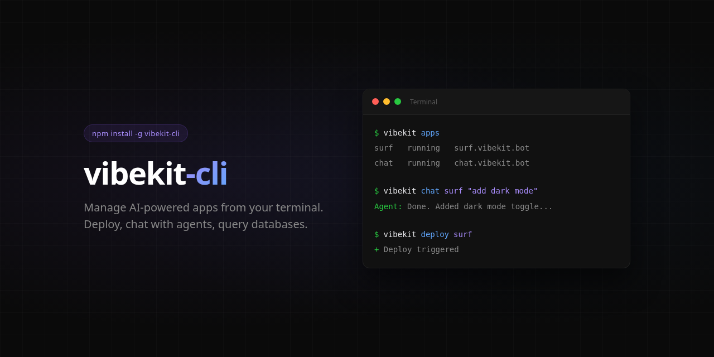

<p align="center">
  
</p>

# vibekit-cli

Manage AI-powered apps from your terminal. Deploy, chat with your AI agent, browse databases, tail logs — all without leaving the command line.

## Install

```bash
npm install -g vibekit-cli
```

## Quick Start

```bash
# Save your API key (get one at https://app.vibekit.bot/settings)
vibekit auth vk_your_key_here

# List your apps
vibekit apps

# Chat with your AI agent
vibekit chat surf "add a contact form to the landing page"

# Tail logs
vibekit logs surf

# Run a SQL query
vibekit db surf query "SELECT * FROM users LIMIT 10"
```

## Commands

### Auth & Account

```bash
vibekit auth <api-key>         # Save API key
vibekit account                # Plan, balance, usage
vibekit usage [app-id]         # Usage stats
```

### Apps

```bash
vibekit apps                   # List your apps
vibekit app <slug>             # App details
vibekit start <slug>           # Start app
vibekit stop <slug>            # Stop app
vibekit restart <slug>         # Restart app
```

### AI Agent

```bash
vibekit chat <slug> "message"  # Send message to your AI agent
vibekit agent <slug>           # Agent status & model
```

### Deploy

```bash
vibekit deploy <slug>          # Trigger redeploy
vibekit deploys <slug>         # Deploy history
vibekit rollback <slug> <id>   # Rollback to previous deploy
```

### Logs & Files

```bash
vibekit logs <slug>            # View logs (--lines 100)
vibekit files <slug> [path]    # Browse workspace files
```

### Environment Variables

```bash
vibekit env <slug>             # List env vars (masked)
vibekit env <slug> --reveal    # Show real values
vibekit env <slug> set KEY=VAL # Set a variable
vibekit env <slug> del KEY     # Delete a variable
```

### Database

```bash
vibekit db <slug>              # Database status
vibekit db <slug> schema       # Tables & columns
vibekit db <slug> table users  # Browse table data
vibekit db <slug> query "SQL"  # Run read-only SQL
vibekit db <slug> export       # Export as SQL dump
```

### Domain

```bash
vibekit domain <slug>          # Show domain config
vibekit domain <slug> set x.co # Set custom domain
vibekit domain <slug> ssl      # Request SSL cert
```

### Quality & Collaboration

```bash
vibekit qa <slug>                          # Run QA audit
vibekit collaborators <slug>               # List collaborators
vibekit collaborators <slug> add email     # Invite
vibekit collaborators <slug> remove <id>   # Remove
```

### Tasks (Headless API)

```bash
vibekit task "Build a landing page"   # Submit coding task
vibekit status <task-id>              # Check task status
vibekit tasks                         # List recent tasks
```

## Flags

- `--json` — Machine-readable JSON output for all commands
- `--reveal` — Show unmasked env variable values
- `--lines N` — Number of log lines to fetch

## Environment Variables

- `VIBEKIT_API_KEY` — API key (overrides saved config)
- `VIBEKIT_API_URL` — Custom API base URL

## Links

- Website: https://vibekit.bot
- Dashboard: https://app.vibekit.bot
- API Docs: https://vibekit.bot/SKILL.md

## License

MIT
